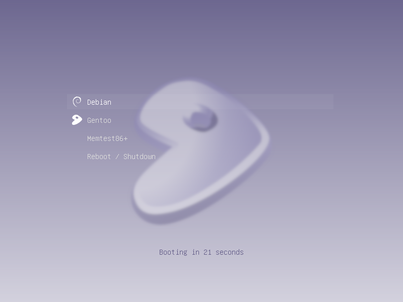
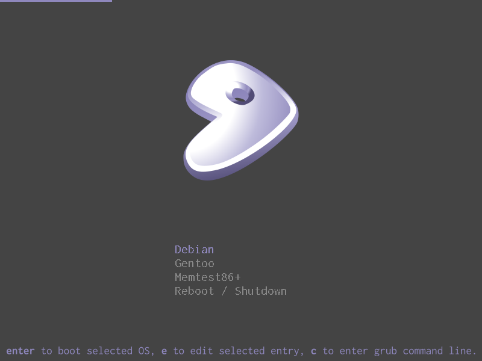

# Grub2 Themes for Gentoo

A few simple Grub2 themes designed with proud gentoo users in mind. They are designed to complement my <a href="github.com/telemin/gentoo-slim-themes">SLiM</a> themes in the same style.

## Glass

Design Cues and icons taken from the excellent <a href="https://github.com/Se7endAY/grub2-theme-vimix">Vimix Theme by Se7endAY</a>.

## Frosted

Blurred version of the glass theme.

## Minimalist

Design cues taken from the <a href="https://github.com/fghibellini/arch-silence">Arch-Silence theme by Filippo Ghibellini</a>

# Design Notes

### Gradient

The light gradient runs between #8f88bd - #f8f7fb

### Fonts

Fonts are the shortcoming of most Grub themes, this is a limitation with Grub itself, which uses the
ppf2 font format which lacks any kerning whatsoever. Fonts can be converted with grub-mkfont, but the
results are highly variable.  

Anyone who has suggestions to improve the overall look of the fonts, particularly in the minimalist theme, please shoot me a message.

# License

This project is licensed under the .

Gentoo Logo is copyright Gentoo Foundation and Lennart Andre Rolland, licensed
under CC-BY-SA/2.5. 

### Author
Phil Tooley
